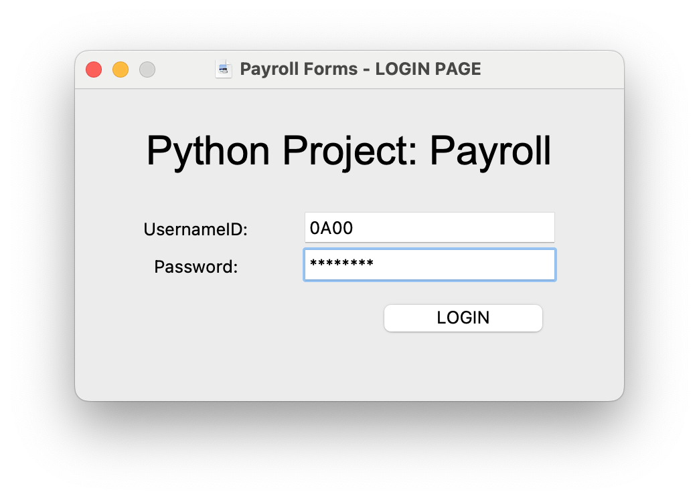
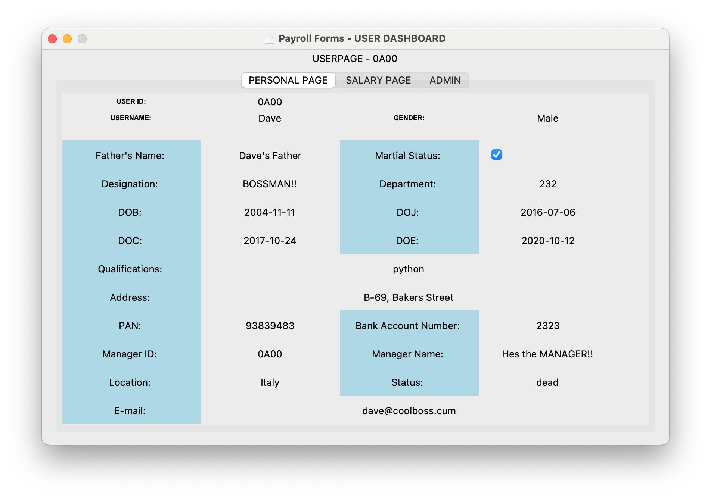

# Payroll Management System

The Payroll Management System is a software application designed to manage and automate various aspects of employee payroll and salary processing. This repository contains the code for the Payroll Management System implemented in Python.


## Initial Login Credentials

- UsernameID: 0A00
- Password: pass@123

## Features

- **User Authentication:** The system provides user authentication using username and password. Different levels of access are available based on user roles (admin or employee).

- **Employee Profile:** Employees can view and update their personal details such as name, gender, date of birth, contact information, etc.

- **Salary Management:** The system allows employees to view their salary details, including basic salary, allowances, deductions, and net salary.

- **Payslip Generation:** Employees can generate monthly payslips in [PDF format](./0A00-September-payslip.pdf), which includes salary details, earnings, deductions, and other relevant information.

- **Admin Control:** Admin users have additional privileges to manage employee records, including adding, editing, and deleting records. They can also manage deduction details and view employee information.

## Installation and Usage

1. Clone the repository to your local machine:

```bash
git clone https://github.com/yourusername/payroll-management-system.git
```

2. Make sure you have Python and the required libraries installed (Tkinter, MySQL connector, FPDF, etc.).

3. Set up your MySQL database and update the database connection details in the code.

4. Run the main script:

```bash
python main.py
```

5. The application will open, and you can log in with your credentials.

## Screenshots



